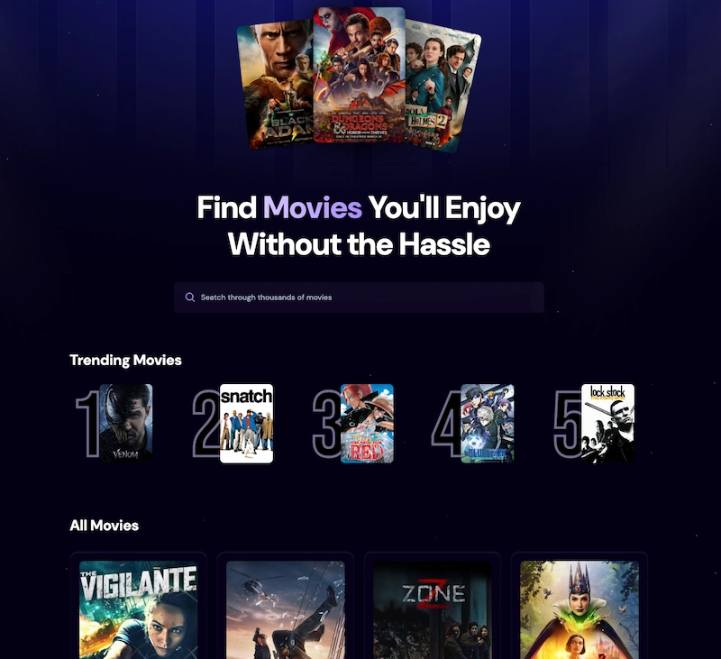

# 🎬 Movies React App

Este proyecto es una aplicación de películas construida con **React** y **Vite** para hacer un repaso de React. Proporciona una interfaz de usuario para buscar y ver detalles de películas utilizando la API de **TMDB**.

<div align="center">


</img>

</div>

<strong><a href="https://movies-react-repaso.onrender.com">LINK</a></strong>

## 🚀 Características

- **🔍 Búsqueda de películas**: Busca tus películas favoritas.
- **📋 Detalles de películas**: Visualiza información detallada sobre cada película.
- **⚠️ Alertas de error**: Muestra alertas en caso de errores.
- **⏳ Cargando Spinner**: Indicador de carga mientras se obtienen los datos.
- **🌐 Cambio de idioma**: Cambia el idioma de la interfaz entre inglés, español y portugués.
- **🔥 Películas en tendencia**: Visualiza una lista de películas en tendencia y accede a sus detalles.

## 🛠️ Tecnologías Utilizadas

- **React**: Biblioteca de JavaScript para construir interfaces de usuario.
- **Vite**: Herramienta de construcción rápida para proyectos web modernos.
- **Tailwind CSS**: Framework de CSS para un diseño rápido y eficiente.
- **Appwrite**: Plataforma backend para gestionar la base de datos y autenticación.

## 📦 Instalación

1. Clona el repositorio:
   ```sh
   git clone https://github.com/tu-usuario/movies-react-app.git
   ```
2. Navega al directorio del proyecto:
   ```sh
   cd movies-react-app
   ```
3. Instala las dependencias:
   ```sh
   pnpm install
   ```

## 🔧 Configuración

Crea un archivo `.env.local` en la raíz del proyecto y añade tus claves de API:

```env
VITE_TMDB_API_KEY=tu_api_key
VITE_APPWRITE_PROJECT_ID=tu_project_id
VITE_APPWRITE_DATABASE_ID=tu_database_id
VITE_APPWRITE_COLLECTION_ID=tu_collection_id
```

## 📂 Estructura del Proyecto

```plaintext
public/                # Archivos estáticos y recursos públicos
src/
├── components/        # Componentes reutilizables
├── App.jsx            # Componente raíz
├── main.jsx           # Entrada principal del proyecto
```

## 📜 Scripts Disponibles

- **`pnpm dev`**: Inicia el servidor de desarrollo.
- **`pnpm build`**: Construye la aplicación para producción.
- **`pnpm lint`**: Ejecuta ESLint para encontrar y arreglar problemas en el código.
- **`pnpm preview`**: Previsualiza la aplicación construida.
